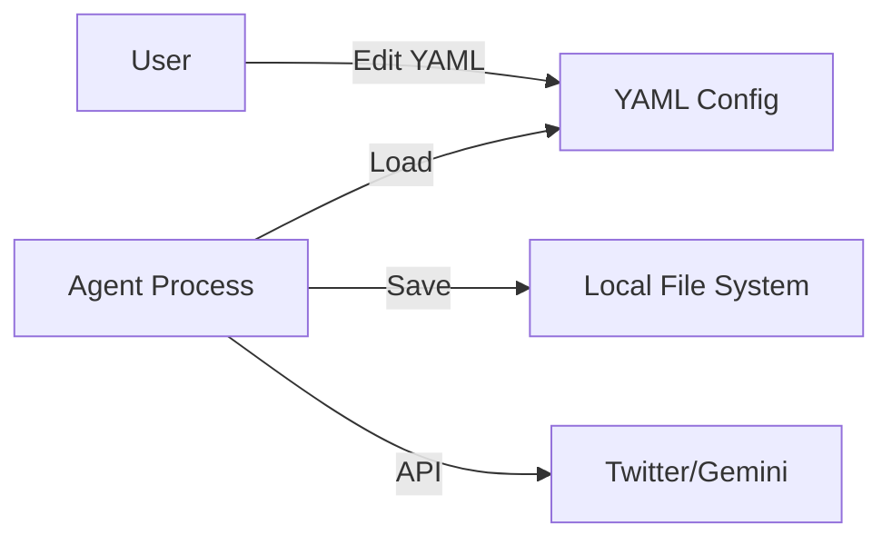
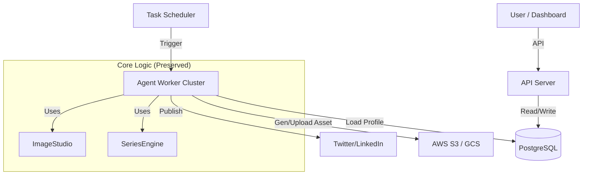

# SaaS Agent Platform Architecture Roadmap
> From Local Single-User Bot to Multi-Tenant AI Agent Platform

이 문서는 현재 구축된 **Advanced Signature Series System**을 다중 사용자(SaaS) 환경으로 확장하기 위한 기술적 청사진입니다. 핵심 로직(`SeriesEngine`)을 유지하면서 인프라 계층을 교체하는 전략을 제시합니다.

## 1. High-Level Architecture

### Current (Local)

### Future (SaaS)

---

## 2. Key Migration Steps

### Step 1: Data Layer (Config -> DB)
YAML 파일로 관리되던 페르소나 설정을 데이터베이스 테이블로 이관합니다.

*   **Users Table**: 사용자 계정, Subscription Plan
*   **Personas Table**: `chef_choi` 같은 페르소나 정의.
    *   Columns: `name`, `system_prompt`, `voice_tone`, `owner_id`
*   **SeriesConfig Table**: 시그니처 시리즈 설정.
    *   Columns: `persona_id`, `platform`, `schedule_cron`, `prompt_template`
*   **Migration Point**:
    *   `PersonaLoader` 클래스를 인터페이스화하여 `FilePersonaLoader`와 `DBPersonaLoader`로 분리하면 코드를 거의 건드리지 않고 교체 가능합니다.

### Step 2: Asset Storage (Local -> Cloud)
로컬 `data/series` 폴더를 클라우드 스토리지로 변경합니다.

*   **Storage**: AWS S3, Google Cloud Storage, or Cloudflare R2
*   **Path Structure**: `s3://bucket/{user_id}/{persona_id}/{series_id}/{uuid}.png`
*   **Migration Point**:
    *   `SeriesArchiver` 클래스의 `save_asset` 메서드만 수정하면 됩니다.
    *   `open(path, 'wb')` 대신 `boto3.upload_fileobj` 등을 사용.

### Step 3: Execution Model (Loop -> Queue)
하나의 `bot.py`가 무한루프를 돌며 체크하는 방식은 수천 명의 유저를 감당할 수 없습니다.

*   **Task Queue**: Celery, Redis Queue, or Temporal.io
*   **Scheduler**: "매일 오후 6시" 같은 스케줄을 트리거하는 Cron 서비스.
*   **Flow**:
    1.  스케줄러가 이벤트 발행: `ExecuteSeries(persona_id=123, series_id=456)`
    2.  놀고 있는 Worker가 메시지 수신.
    3.  Worker가 DB에서 설정 로드 -> `SeriesEngine.execute()` 실행.
    4.  완료 후 결과 DB 저장.

---

## 3. Security & Multi-Tenancy

### Isolation (격리)
*   **Data Isolation**: 모든 SQL 쿼리에 `WHERE user_id = ?` 필수 적용.
*   **Token Management**: 사용자별 트위터 토큰(`access_token`)은 암호화하여 DB에 저장 (AES-256). 절대 `.env` 파일이 아님.

### Scalability (확장성)
*   **Stateless Workers**: Worker 프로세스는 상태를 가지지 않으므로, 유저가 늘어나면 Worker 컨테이너만 더 띄우면 됨 (Horizontal Scaling).
*   현재의 `Topic Queue`는 Redis List나 DB Table로 관리하여 동시성 문제 해결.

---

## 4. Preserved Code Value (현재 코드의 가치)
지금 작성하신 코드는 SaaS 전환 시 **90% 이상 재사용** 가능합니다.

| Component | Status | Note |
| (Modules) | (Effect) | (SaaS Migration) |
| --- | --- | --- |
| **SeriesEngine** | **Keep** | 로직은 인프라에 무관함 (순수 파이썬 로직) |
| **Planner** | **Keep** | DB에서 큐만 가져오도록 함수 1개 수정 |
| **ContentWriter** | **Keep** | LLM 프롬프트 로직은 그대로 사용 |
| **ImageStudio** | **Keep** | 이미지 생성 로직 그대로 사용 |
| **PlatformAdapter**| **Keep** | 트윗 게시 로직 그대로 사용 |
| *PersonaLoader* | *Replace* | `DBLoader`로 교체 |
| *Archiver* | *Replace* | `S3Archiver`로 교체 |

## 5. Next Action for SaaS
당장 SaaS를 만드는 것이 목표라면 다음 스텝을 추천합니다:

1.  **FastAPI 도입**: 웹 서버 구축.
2.  **Supabase / Firebase**: 빠르게 DB와 Auth를 붙여서 프로토타이핑.
3.  **Dockerize**: 현재 에이전트를 컨테이너 이미지로 빌드.

현재 구조는 **Micro-SaaS를 위한 가장 탄탄한 MVP(Minimum Viable Product)** 상태입니다.
